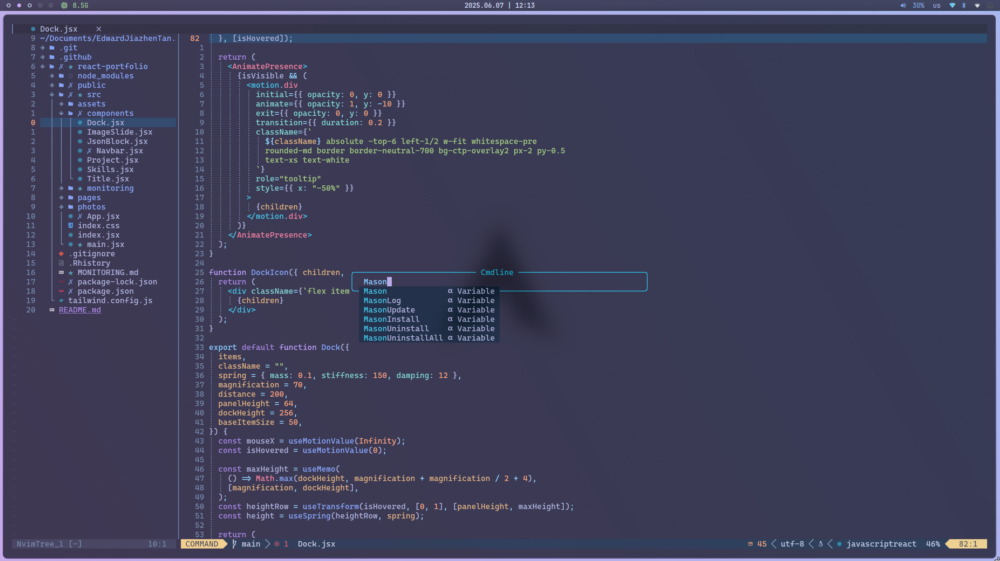

# Neovim Configuration

This is my personalized Neovim setup using [LazyVim](https://github.com/LazyVim/LazyVim) as the plugin manager. The configuration is inspired by [josean-dev](https://github.com/josean-dev/dev-environment-files).

## Setup

1. Clone this repository:
   ```bash
   git clone https://github.com/EdwardJiazhenTan/nvim.git ~/.config/nvim
   ```
2. Open Neovim and run:
   ```vim
   :Lazy
   ```

## Key Plugins

- **Core**: plenary.nvim, which-key.nvim, vim-tmux-navigator
- **UI**: bufferline.nvim, nvim-web-devicons, zen-mode.nvim, alpha.nvim
- **Syntax**: nvim-treesitter, todo-comments.nvim
- **Navigation**: telescope.nvim, nvim-tree.lua
- **Editing**: nvim-surround, nvim-autopairs, Comment.nvim
- **Git**: lazygit.nvim, gitsigns.nvim
- **LSP**: nvim-lspconfig, null-ls.nvim (formatting)
- **Completion**: nvim-cmp, LuaSnip, friendly-snippets
- **AI**: avante.nvim (local model support)

## Custom Keymaps

- `jk` → Exit insert mode
- `<space>` → Leader key
- `<leader>w` → Save file
- `<leader>q` → Quit without saving
- `<leader>wq` → Save and quit
- `<leader>qa` → Quit all without saving
- `<leader>nh` → Clear search highlights
- `<leader>sv` → Split window vertically
- `<leader>sh` → Split window horizontally
- `<leader>sx` → Close current split
- `<leader>lg` → Open LazyGit
- `<leader>z` → Toggle Zen Mode

## Screenshots



## Inspiration

- Author: [josean-dev](https://github.com/josean-dev)
- Configuration videos: [YouTube Playlist](https://www.youtube.com/playlist?list=PLnu5gT9QrFg36OehOdECFvxFFeMHhb_07)
